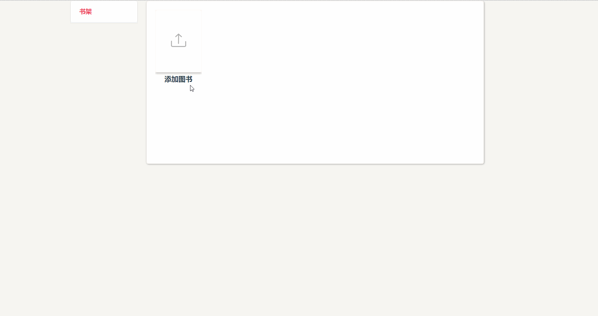
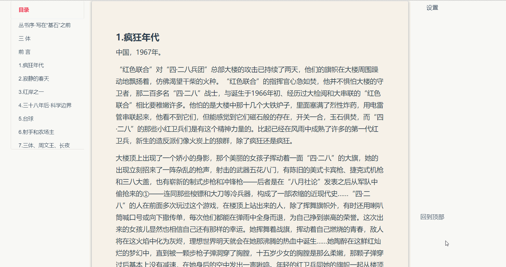
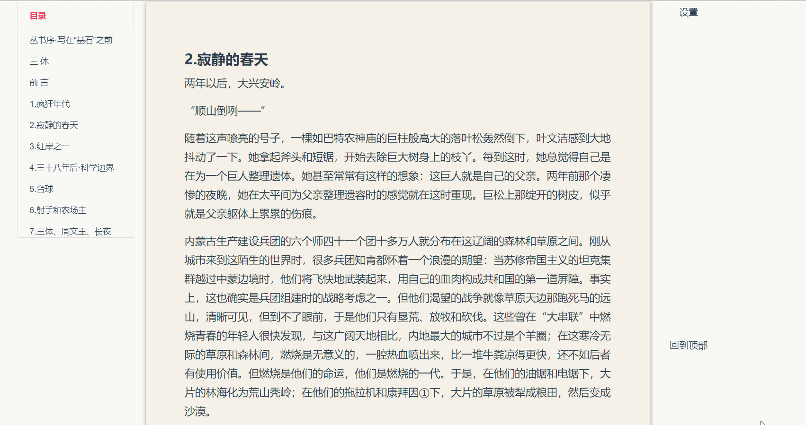

# Epub-Web-Reader

一个完全利用现代浏览器本地存储功能的 `Epub` 格式电子书的 `Web` 解析+阅读器

### 已完成功能：

- 本地图书导入
- 格式解析+本地存储(`IndexedDB + LocalStorage`)
- 阅读+目录+跳转章节
- 主题设置+字体设置+字体大小设置
- 书架页+书籍封面显示

### 打算做的功能：

- 书签功能
- 记录上次阅读位置
- 翻页方式切换

### 技术栈：

- `Vue + Vuex + Vue-Router`
- `Es6+`

- `IndexedDB + LocalStorage`

- `Scss`

### 工程化：

- `vue/cli3 + babel + yarn`

### 展示：

**书架页**

**阅读页**

**选择章节**

**设置**

